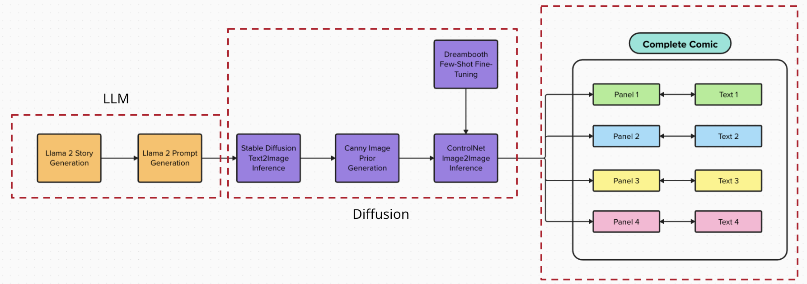
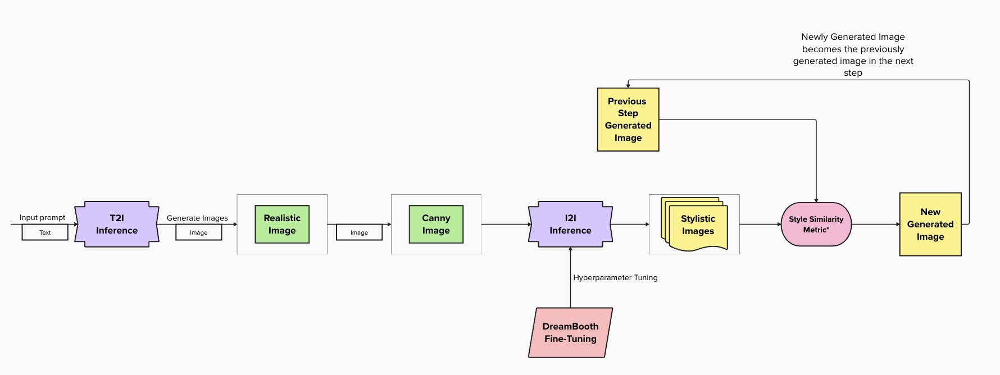
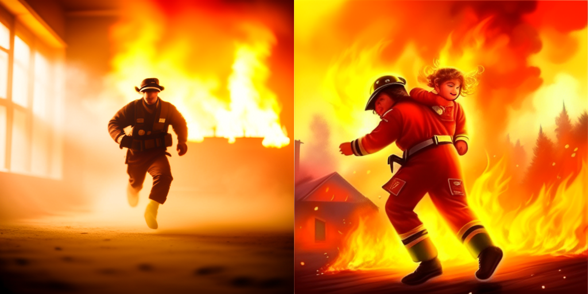
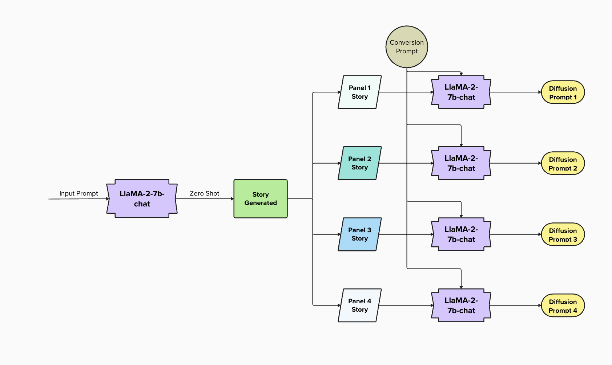

# Few-Shot Fine-Tuning for Diffusion-Based Comic Generation (Text to Image | Large Language Model + Diffusion)
This repository is created for the project done for 16824 - Visual Learning and Recognition course offered at Carnegie Mellon University (Fall 2023).
This repository contains the code for a novel approach to generating comics by employing machine learning techniques. The project focuses on transforming text prompts into visually expressive comic illustrations, utilizing stable diffusion models for coherence in visual storytelling.


Permission(s)/License Required:
Access to LlaMa-2 (https://github.com/facebookresearch/codellama)


## Table of Contents

- [Introduction](#introduction)
- [Methodology](#methodology)
- [Getting Started](#getting-started)
- [Usage](#usage)
- [Results](#results)
- [Contribution](#contribution)
- [License](#license)
- [Acknowledgments](#acknowledgments)

## Introduction

Welcome to the Comic Generation project, where we explore the exciting intersection of text prompts and machine learning to create captivating comic illustrations. Leveraging stable diffusion models for visual storytelling consistency\cite{rombach2021highresolution}, our goal is to develop a model that generates comics in a specified style from textual prompts.

## Project Objectives and Questions
- **Objective:** Develop a model for generating comics from text.
- **Questions:**
  1. How do we maintain a consistent style across comic panels?
  2. What methods enable effective comic panel generation from the text prompts?

Encountering challenges, we refined the stable diffusion model by fine-tuning it with images matching the desired comic art style. To address the uniformity across panels, a Similarity Metric was introduced, ensuring content preservation and information transfer.

Explore our results to see a series of comic panels with a consistent art style, showcasing the model's ability to transform text prompts into engaging visual narratives.

## Methodology

The dataset includes two art styles - the first style is action-based with lots of motion, and the second style is more cartoon-like.

The pipeline involves a text-to-image-to-image structure, utilizing large language models, stable diffusion models, and fine-tuning techniques. The process includes story generation, prompt generation for diffusion models, stable diffusion with fine-tuning, and a control network for style transfer.

For a detailed explanation of the methodology, refer to the Methodology section in the Report.



## Getting Started

To get started with the project, follow these steps:

1. Clone the repository:
```python
git clone https://github.com/YashPat22/16824_VLR_ComicGen
```
2. Install required dependencies

## Usage

To generate comics using the provided pipeline, create a story from the notebook by modifying the prompts and saving them as a text file. Feed them into the diffusion model.


## Results

### Diffusion Model



### Large Language Model

Before the Large Language Model is used, a test is done to check how the untrained Lanugage Model performs against the fine-tuned chat model.

The prompts given to both the models are the same, which is: "Generate a story about how a dog learns it has superpowers [INST]Generate a 2 panel comic[/INST]"

We notice how the chat model performs much better in this context which enabled us to zero shot prompt it for generating stories.
The prompts are also iteratively developed for the second stage of the process - creation of diffusion prompts which can be found in Language_Model/Dog_Story.ipynb

The results can be seen in [Language Model Iteration](Language_Model/Dog_Story.ipynb):

## Contributions
Our contributions include:
- Application of text-to-image diffusion models for generating comic panels.
- Implementation of style transfer techniques.
- Extensive study on maintaining style and content consistency.

## License
This project is MIT licensed.

## Acknowledgements
We would like to express our gratitude to the following individuals and resources for their valuable contributions and support during the development of this class project:

- **Prof. Jun-Yan Zhu:** We extend our sincere appreciation to Prof. Jun-Yan Zhu and the teaching team for their guidance, mentorship, and insightful feedback throughout the project. Their expertise has been instrumental in shaping our understanding and approach.

- **Open Source Community:** We appreciate the broader open-source community for creating and maintaining the tools, libraries, and platforms that supported our project.

This project wouldn't have been possible without the collective efforts and support of everyone mentioned above. Thank you all for being part of this journey!

